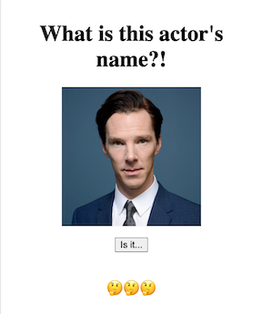

# Benedict Cumberbatch Silly Name Generator

## Description

This name generator offers silly alternative names for the popular actor with the unsual moniker. There are currently 10 avaiable options for first and last names that get randomized, added together, and displayed on the screen when you click the button. 

- It was intended not intended to mock anyone.
- I built this to practice the JavaScript skills I've been learning.
- This build was more simple than others I've done but I'm excited by the prospect of adding to it.
- I intend to replace the arrays with API calls in the future for a more robust product.

## Usage

Click the button to make a random name appear on the screen. You can click as many times as you like to generate new name combinations.

## Deployment

[Silly Name Generator](https://katemcro.github.io/sillyNameGen/)

## License

MIT License

Copyright (c) 2023 Kate Rogers

Permission is hereby granted, free of charge, to any person obtaining a copy
of this software and associated documentation files (the "Software"), to deal
in the Software without restriction, including without limitation the rights
to use, copy, modify, merge, publish, distribute, sublicense, and/or sell
copies of the Software, and to permit persons to whom the Software is
furnished to do so, subject to the following conditions:

The above copyright notice and this permission notice shall be included in all
copies or substantial portions of the Software.

THE SOFTWARE IS PROVIDED "AS IS", WITHOUT WARRANTY OF ANY KIND, EXPRESS OR
IMPLIED, INCLUDING BUT NOT LIMITED TO THE WARRANTIES OF MERCHANTABILITY,
FITNESS FOR A PARTICULAR PURPOSE AND NONINFRINGEMENT. IN NO EVENT SHALL THE
AUTHORS OR COPYRIGHT HOLDERS BE LIABLE FOR ANY CLAIM, DAMAGES OR OTHER
LIABILITY, WHETHER IN AN ACTION OF CONTRACT, TORT OR OTHERWISE, ARISING FROM,
OUT OF OR IN CONNECTION WITH THE SOFTWARE OR THE USE OR OTHER DEALINGS IN THE
SOFTWARE.